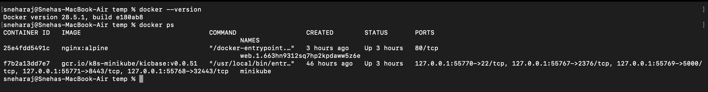
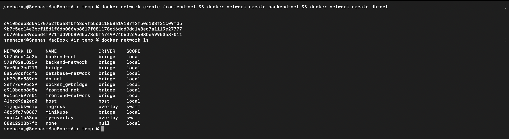
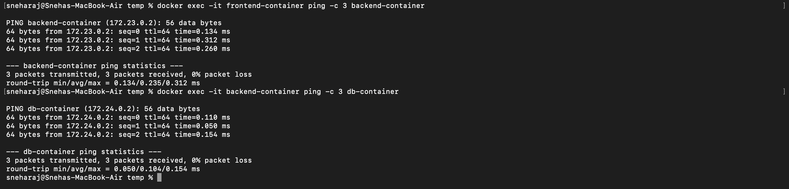
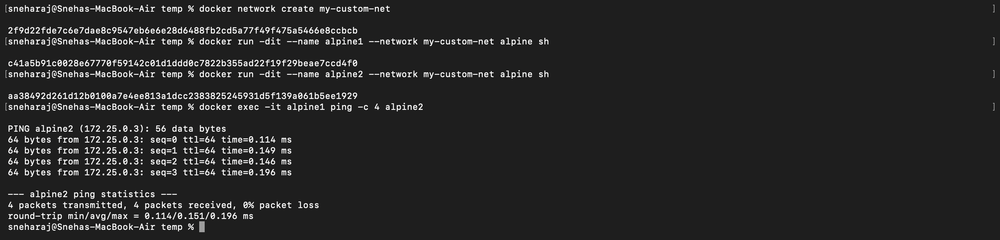
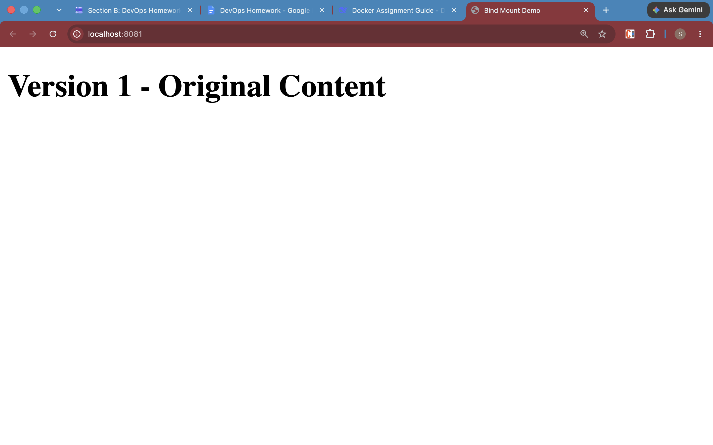
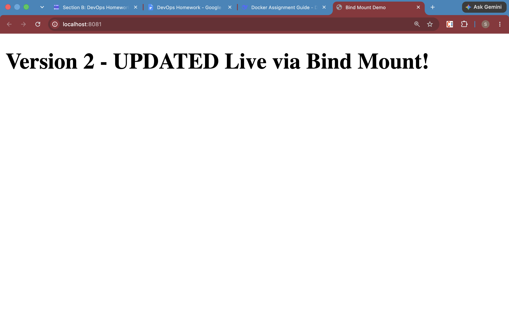
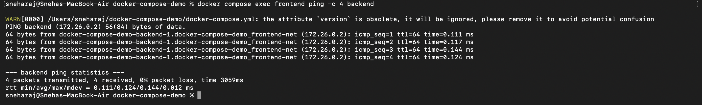
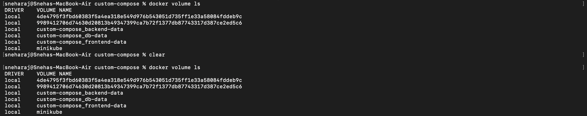
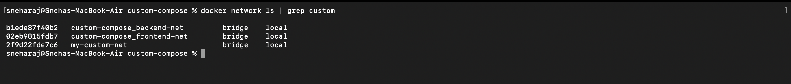
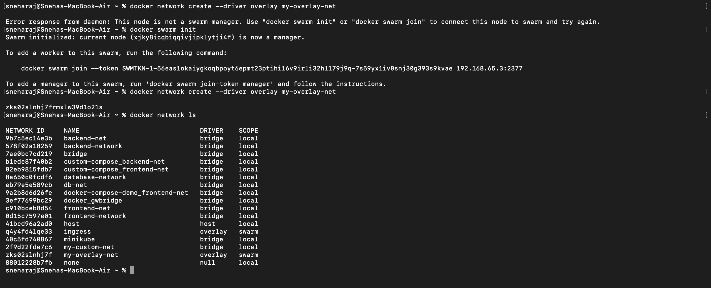

# Docker Assignment – README

## Tasks

| Task | Description | Screenshots |
|------|-------------|-------------|
| 1 | Three networks (frontend-net, backend-net, db-net) + three containers connected | 2, 3 |
| 2 | Two Alpine containers on custom network + ping | 4 |
| 3 | Bind mount with live index.html update | 5, 6 |
| 4 | Provided Docker Compose demo (nginx on 8080, ping backend) | 7, 8 |
| 5 | Custom Compose: bind + named volumes, user-defined bridge networks, backend Dockerfile, depends_on | 9, 10 |
| 6 | Overlay network research (multi-host / Swarm use case) | 11 |

---

## Screenshots

### 1. Docker Version & Running Containers

### 2. Three Networks Created

### 3. Container Pings Across Networks

### 4. Two Alpine Containers on Custom Network

### 5. Bind Mount – Original Content

### 6. Bind Mount – Live Updated Content

### 7. Provided Compose – Nginx on Port 8080

### 8. Compose Demo – Frontend Pings Backend

### 9. Custom Compose – Named Volumes

### 10. Custom Compose – User-Defined Bridge Networks

### 11. Overlay Network (Swarm)
