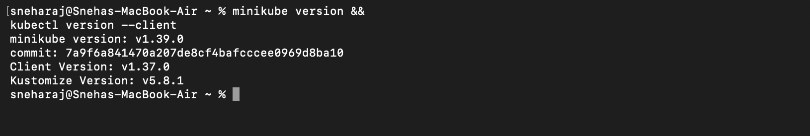
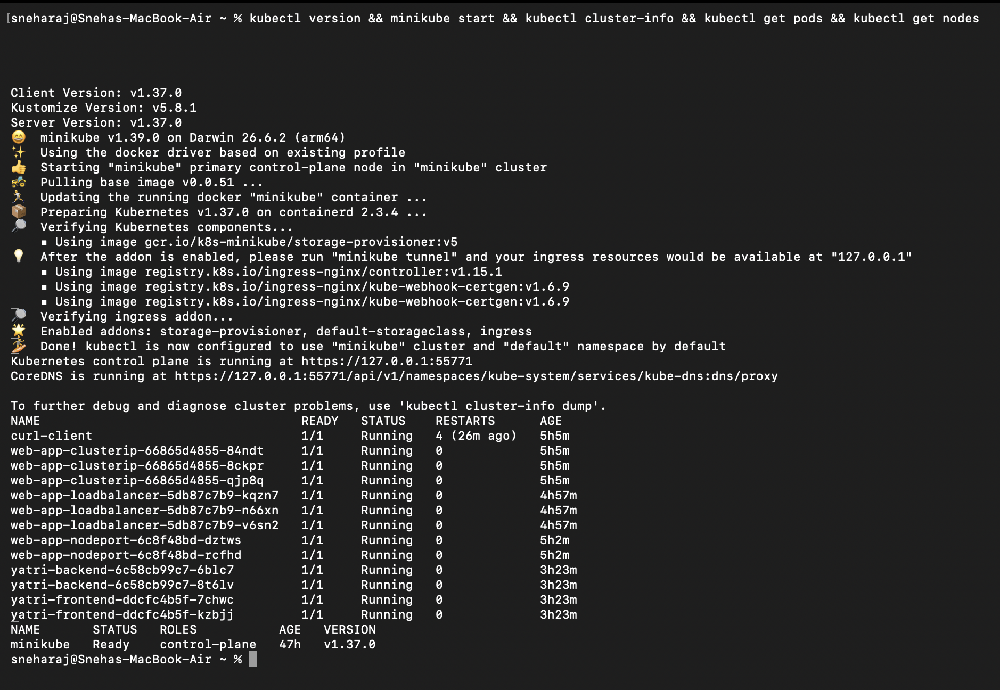
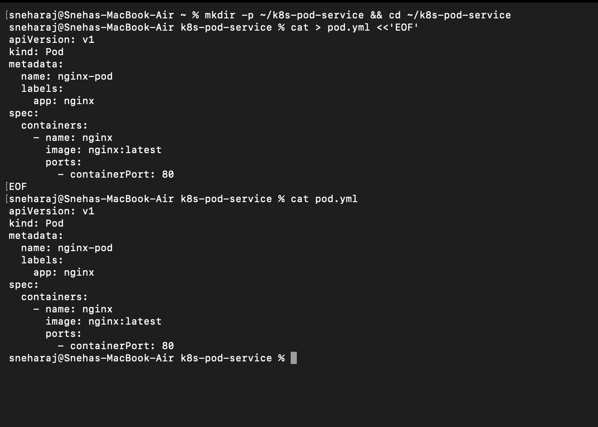
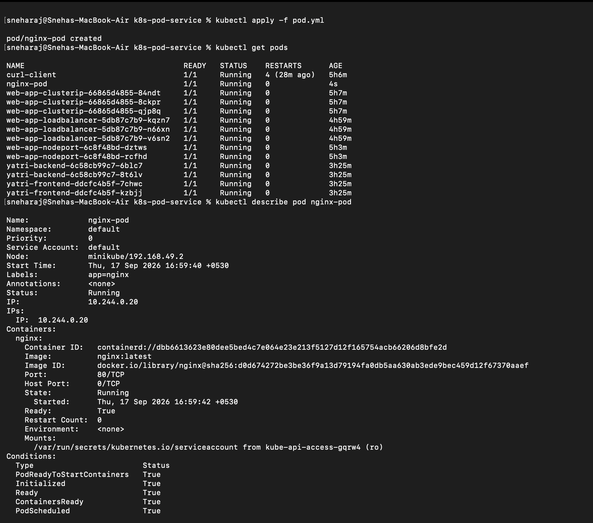
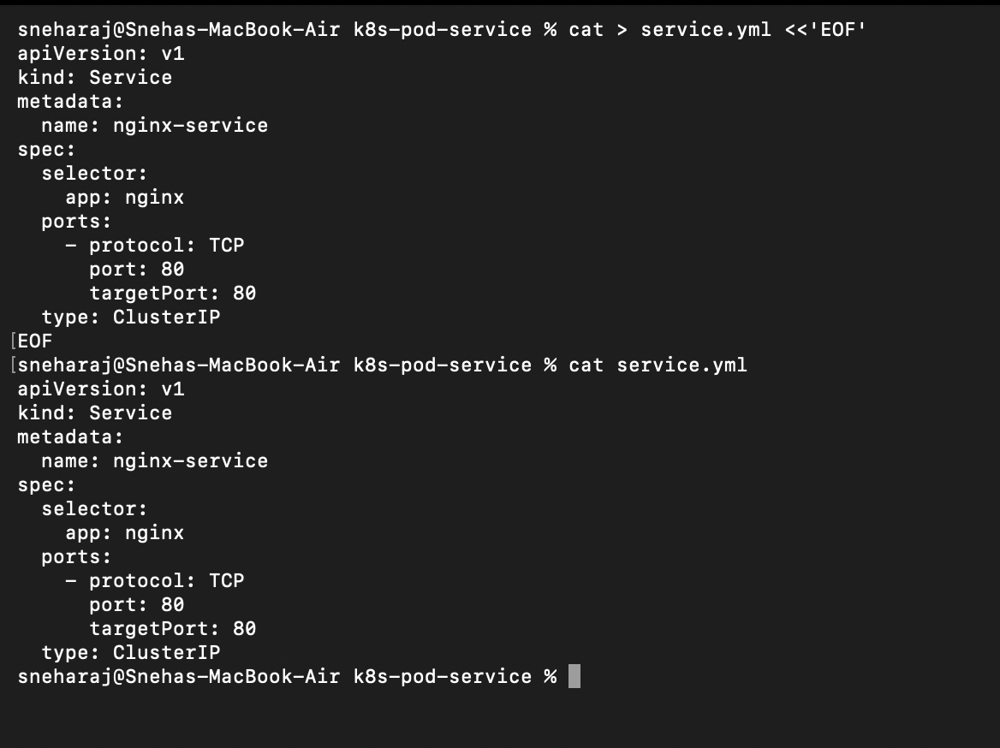
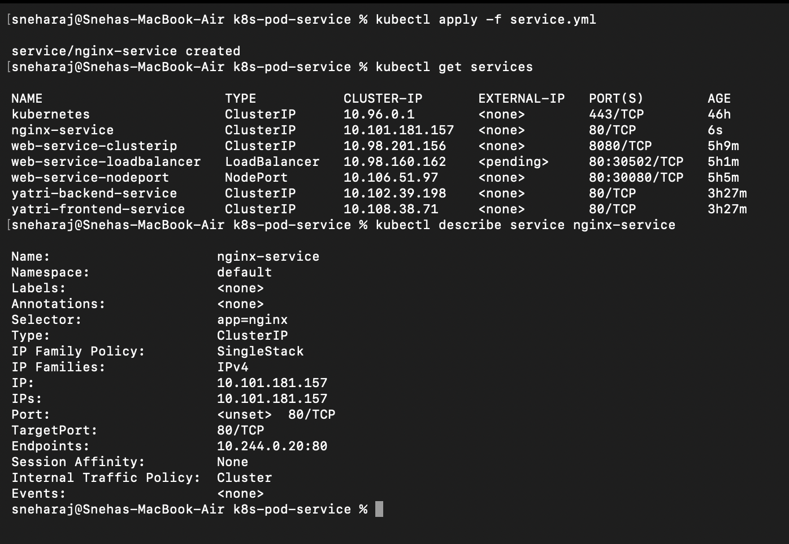
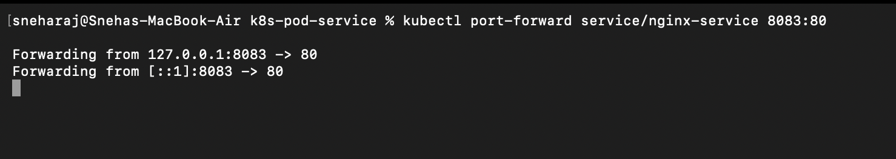
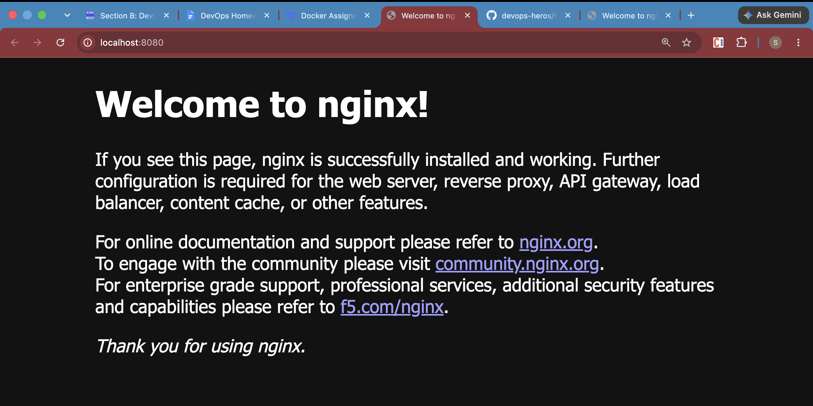
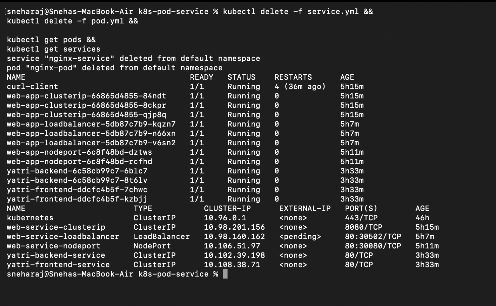

# Kubernetes Pod + Service Assignment – README

## Tasks

| Task | Description | Screenshots |
|------|-------------|-------------|
| 1 | Verify Minikube & kubectl install | One |
| 2 | Start Minikube + cluster info + pods + nodes | Two |
| 3 | Write and view `pod.yml` | Three |
| 4 | Apply `pod.yml` and verify pod | Four |
| 5 | Write and view `service.yml` | Five |
| 6 | Apply `service.yml` and verify service | Six |
| 7 | Port-forward to access Nginx | Seven |
| 8 | Nginx webpage on localhost | Eight |
| 9 | Cleanup – delete pod & service | Nine |

---

## Screenshots

### One – Minikube & Kubectl Version

### Two – Start Minikube, Cluster Info, Pods, Nodes

### Three – pod.yml Contents

### Four – Apply pod.yml & Describe Pod

### Five – service.yml Contents

### Six – Apply service.yml & Describe Service

### Seven – Port-Forward Running

### Eight – Nginx Welcome Page

### Nine – Cleanup

---

## Notes
- YAML syntax practiced while writing `pod.yml` and `service.yml` by hand.
- Kubernetes documentation reviewed for Pods, Services, and kubectl usage.