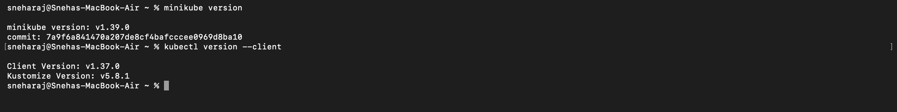
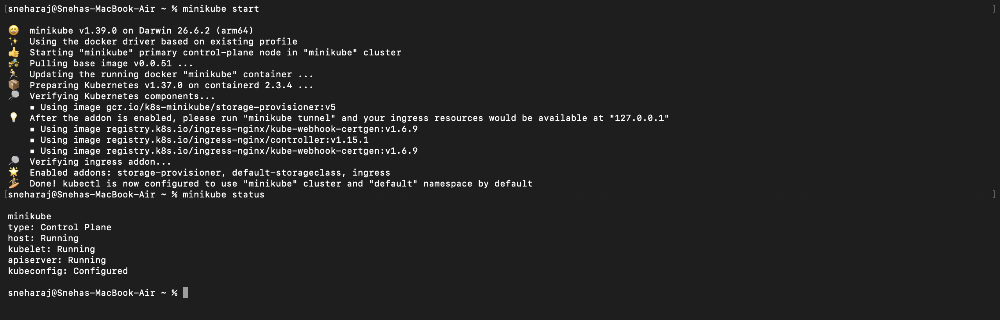
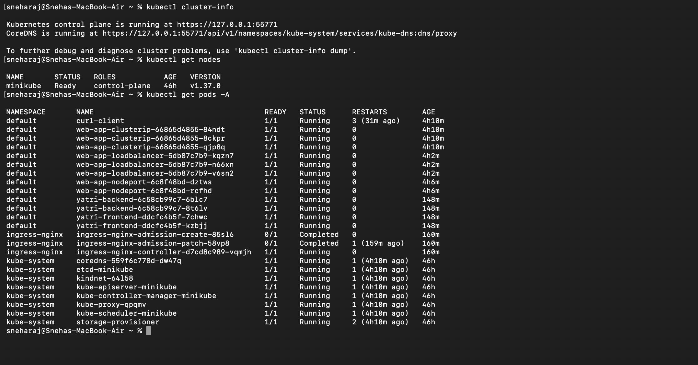
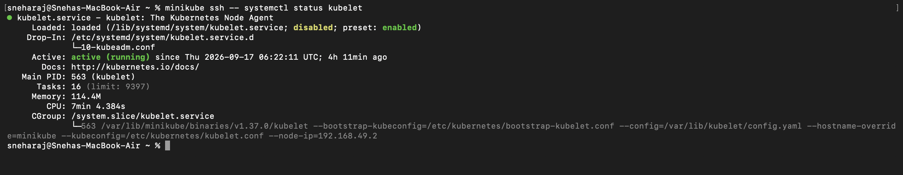
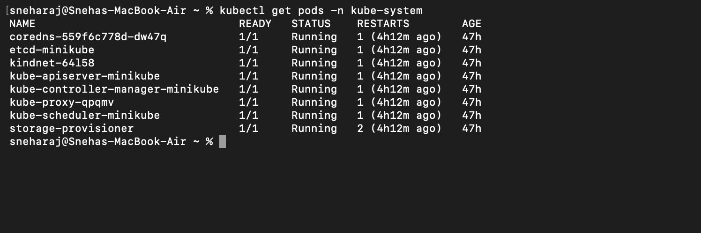
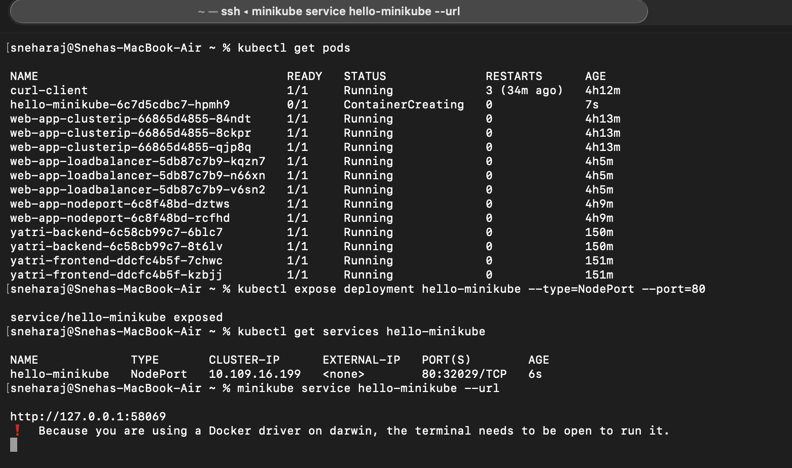
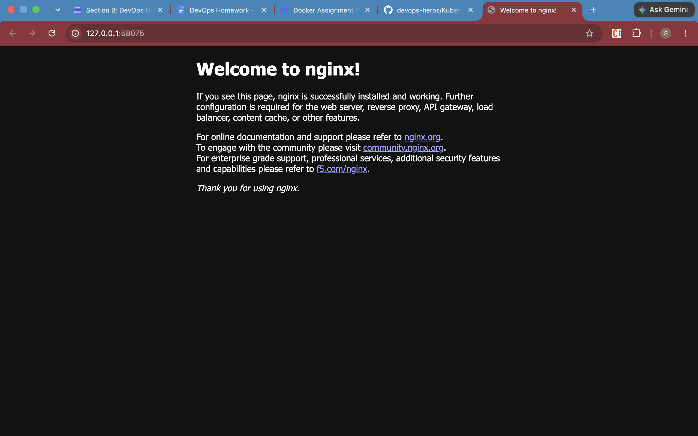
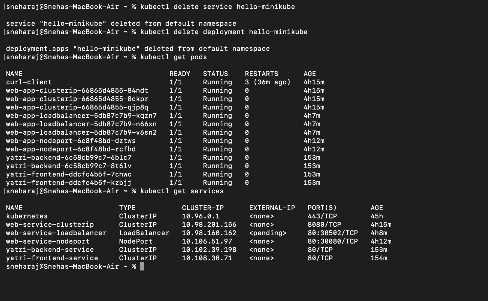

# Kubernetes / Minikube Assignment – README

## Tasks

| Task | Description | Screenshots |
|------|-------------|-------------|
| 1 | Verify Minikube installation | One |
| 2 | Start Minikube and check status | Two, Three |
| 3 | Verify cluster is working (cluster-info, nodes, pods) | Four |
| 4 | Explore Kubernetes architecture components | Five, Six |
| 5 | Deploy Nginx (Hello Minikube tutorial) | Seven, Eight |
| 6 | Cleanup deployment | Nine |
| 7 | Cloud Controller Manager research (R&D) | — |

---

## Screenshots

### One – Minikube & Kubectl Version

### Two – Minikube Start & Status

### Three – Cluster Info, Nodes & All Pods

### Four – Kubernetes Architecture (kube-system Pods)

### Five – Kubelet Status

### Six – Hello Minikube – Pods, Service & URL

### Seven – Nginx Welcome Page

### Eight – Cleanup – Pods & Services Deleted

---

## Task 7 – Cloud Controller Manager (R&D)

**What is CCM?**
A Kubernetes control plane component that embeds cloud-specific control logic, allowing Kubernetes to interact with the underlying cloud provider's API.

**Three controllers:**
1. **Node Controller** – manages node lifecycle in the cloud.
2. **Route Controller** – configures routes in the cloud network.
3. **Service Controller** – provisions cloud load balancers for `LoadBalancer` services.

**When used:**
Only in cloud environments (AWS, GCP, Azure). Not applicable to Minikube on bare metal / local Docker.