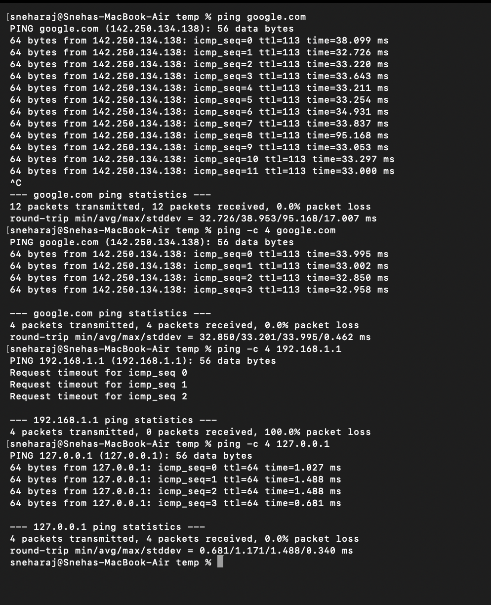
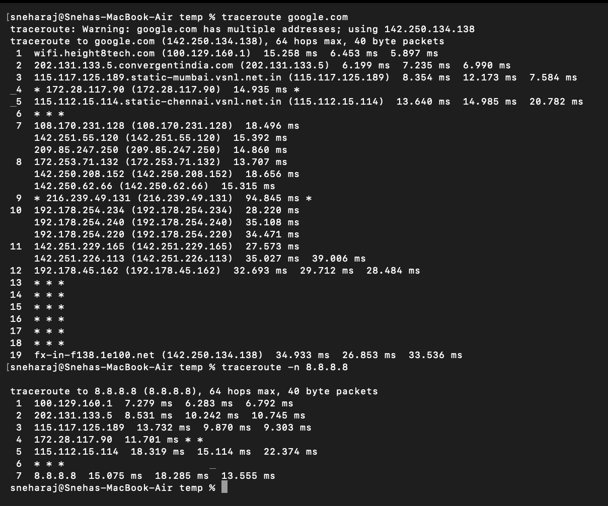
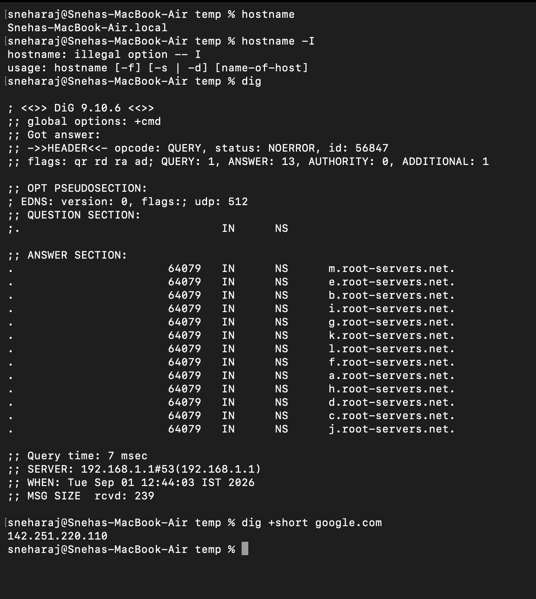
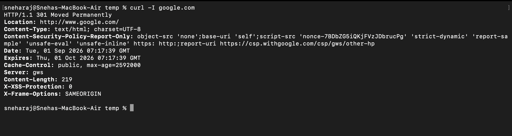

# Networking Homework Assignment

## Task 1: DevOps-Hero GitHub Repo Practice

### Commands Practiced
Based on the DevOps-Hero GitHub repository, I practiced the following networking commands:
- `ping` - Testing network connectivity
- `traceroute` - Tracing network paths
- `ifconfig` - Viewing network interface configuration (macOS equivalent of `ip addr` on Linux)
- `netstat` - Network statistics (macOS equivalent of `ss` on Linux)

---

## Task 2: Networking Commands - Execution and Documentation

### 1. PING Command

#### Command Executed:


#### Explanation:
The ping command tests network connectivity to a remote host by sending ICMP echo request packets. From the output:

- **Successful ping to google.com:** Shows 0% packet loss with an average response time of ~33ms, indicating good network connectivity.
- **Failed ping to 192.168.1.1:** 100% packet loss indicates either the gateway doesn't exist or ICMP is blocked.
- **Successful ping to 127.0.0.1:** Local loopback works correctly, confirming the TCP/IP stack is functional.

**Key observations:**
- `ttl=113` indicates the number of hops the packet traveled (starts at 128 on Linux, decreasing each hop).
- `icmp_seq` shows the sequence number of each packet.
- `time` shows round-trip time in milliseconds.
- `-c 4` limits the number of packets sent.

---

### 2. TRACEROUTE Command

#### Command Executed:


#### Explanation:
The traceroute command shows the path packets take to reach a destination. Each line represents a hop (router) along the path:

- **Hop 1:** `100.129.160.1` - Local Wi-Fi router (6-15ms response)
- **Hop 2:** `202.131.133.5` - ISP's first router (6-10ms)
- **Hop 3:** `115.117.125.189` - Mumbai VSNL network (8-12ms)
- **Hops 4-6:** Some routers don't respond (shown as `*`), often due to firewall settings.
- **Hops 7-19:** Google's internal network and final destination.

**Key observations:**
- The `-n` flag skips DNS resolution, showing IP addresses only and making it faster.
- `*` indicates a router that didn't respond (ICMP may be blocked).
- Multiple times per hop show round-trip times for each probe.
- The final destination is reached in 19 hops on macOS.

*Note for macOS users: traceroute may need to be installed via Homebrew (`brew install traceroute`) if not available.*

---

### 3. IFCONFIG Command (macOS equivalent of Linux ip addr)

#### Command Executed:


#### Additional Commands Tested:


#### Explanation:
The `ifconfig` command displays network interface configuration. On macOS, this is the primary tool for viewing network interfaces (the Linux `ip addr` command is not available).

**Key interfaces on my system:**
- `lo0`: Loopback interface (127.0.0.1) - used for local communication.
- `en0`: Wi-Fi interface (MAC: 9c:58:84:28:5b:74) - my active internet connection.
- `en1`/`en2`: Thunderbolt interfaces (currently inactive).
- `utun0`/`utun1`/`utun2`/`utun3`: VPN tunnel interfaces.
- `bridge0`: Virtual bridge interface for Thunderbolt.

**Understanding the flags:**
- `UP`: Interface is operational.
- `BROADCAST`: Supports broadcast addresses.
- `RUNNING`: Interface is active.
- `SIMPLEX`: Can only transmit one packet at a time.
- `MULTICAST`: Supports multicast.
- `PROMISC`: Promiscuous mode (captures all packets).

*Note for macOS users: Unlike Linux which uses `eth0`, `enp0s3` for Ethernet, macOS uses `en0` for Wi-Fi and `en1`/`en2` for Thunderbolt interfaces.*

---

### 4. NETSTAT Command (macOS equivalent of Linux ss)

*Note: On macOS, the `ss` command is not available. Instead, `netstat` is used for similar functionality.*

#### Command Executed:


#### Explanation:
The `netstat` command displays network connections, routing tables, and interface statistics.

**Common netstat options on macOS:**
- `-rn`: Show routing table with numeric addresses.
- `-an`: Show all connections with numeric addresses.
- `-anvp tcp`: Show TCP connections with process information.
- `-anvp udp`: Show UDP connections with process information.

**Understanding the routing table:**
- `default`: Default gateway (0.0.0.0) - routes all external traffic.
- `127.0.0.1`: Localhost - local communication.
- `192.168.1/24`: Local network subnet.

---

### 5. HOSTNAME Command

- **Linux command:** `hostname`
- **macOS command:** `hostname` (same)
- **Purpose:** Displays the system's hostname.

#### Commands to Execute:
```bash
# Show hostname
hostname

# Show all IP addresses (macOS may not support -I)
hostname -I  # Works on Linux
```



#### Explanation:
The `hostname` command displays the system's hostname. On macOS, the output is typically `[username]-MacBook-Air.local`. This command is useful for identifying the system on a network.

---

### 6. DIG Command (DNS Lookup)

- **Linux command:** `dig`
- **macOS command:** `dig` (same, usually pre-installed)
- **Purpose:** Queries DNS servers for domain information.

#### Commands to Execute:
```bash
# Basic DNS lookup
dig google.com

# Show only IP addresses
dig +short google.com

# Query specific DNS record types
dig google.com MX
dig google.com NS
```

---

### 7. NSLOOKUP Command (DNS Query)

- **Linux command:** `nslookup`
- **macOS command:** `nslookup` (same, usually pre-installed)
- **Purpose:** Queries DNS servers for domain information (simpler than dig).

#### Commands to Execute:
```bash
nslookup google.com
```

#### Explanation:
`nslookup` (Name Server Lookup) queries DNS servers to resolve domain names to IP addresses. It's simpler than `dig` but provides essential DNS information like the IP address associated with a domain name.

---

### 8. CURL Command

- **Linux command:** `curl`
- **macOS command:** `curl` (pre-installed)
- **Purpose:** Transfers data to/from a server.

#### Commands to Execute:



#### Explanation:
`curl` (Client URL) is a command-line tool for transferring data with URLs. The `-I` option shows only the HTTP headers, which is useful for checking server responses and troubleshooting web connectivity.

---

### 9. ARP Command

- **Linux command:** `arp`
- **macOS command:** `arp -a` (same)
- **Purpose:** Shows the ARP (Address Resolution Protocol) cache, mapping IP to MAC addresses.

#### Commands to Execute:
```bash
# Show ARP table
arp -a

# Show only numeric addresses
arp -n
```

#### Explanation:
The `arp` command displays the ARP cache, which maps IP addresses to MAC (hardware) addresses on the local network. This helps in troubleshooting network connectivity issues at the data link layer.

---

### 10. ROUTE Command

- **Linux command:** `route`
- **macOS command:** `route` (syntax differs slightly)
- **Purpose:** Shows and manipulates the IP routing table.

#### Commands to Execute:
```bash
# Show default gateway (macOS)
route -n get default

# Show routing table (macOS)
netstat -rn

# Show routing table (Linux)
route -n
```


#### Explanation:
The `route` command shows how network traffic is directed through the system. The default gateway is the router that handles traffic to external networks. The routing table displays all known networks and how to reach them.

---

## Summary Table of Networking Commands

| Command | Linux Syntax | macOS Notes | Purpose |
| :--- | :--- | :--- | :--- |
| **ping** | `ping -c 4 google.com` | Same | Test network connectivity |
| **traceroute** | `traceroute google.com` | May need `brew install traceroute` | Trace network path |
| **ifconfig** | `ifconfig` | Use instead of `ip addr` | View network interfaces |
| **ip addr** | `ip addr` | NOT AVAILABLE on macOS | Linux-only command |
| **ss** | `ss -tuln` | NOT AVAILABLE on macOS | Linux-only command |
| **netstat** | `netstat -rn` | Same (but different options) | View network statistics |
| **hostname** | `hostname` | Same | Show system hostname |
| **dig** | `dig google.com` | Same | DNS lookup |
| **nslookup** | `nslookup google.com` | Same | DNS query |
| **curl** | `curl -I google.com` | Same | Transfer data |
| **arp** | `arp -a` | Same | View ARP cache |
| **route** | `route -n` | Use `netstat -rn` or `route -n get default` | View routing |
| **networksetup** | Not available | macOS specific | Configure network settings |

---

## Key Differences: macOS vs Linux Commands

| Feature | Linux | macOS |
| :--- | :--- | :--- |
| **Network interface names** | `eth0`, `enp0s3` | `en0`, `en1` |
| **Primary interface tool** | `ip addr` | `ifconfig` |
| **Socket statistics** | `ss -tuln` | `netstat -an` |
| **Package manager** | `apt-get`, `yum` | `brew` (Homebrew) |
| **Service management** | `systemctl` | `launchctl` |
| **Default shell** | `bash` (often) | `zsh` (default since Catalina) |

---

## Learning Outcomes

- **PING Command:** I learned that ping tests network connectivity by sending ICMP packets. The response time and packet loss percentage indicate network health. I saw that my connection to Google has 0% packet loss with ~33ms response time.
- **TRACEROUTE Command:** I understood that traceroute maps the path packets take through multiple routers. The `*` entries indicate routers that don't respond, often due to firewall settings. The route to Google goes through 19 hops from Mumbai.
- **IFCONFIG Command:** I learned that on macOS, `ifconfig` is used instead of Linux's `ip addr` to view network interfaces. My active Wi-Fi interface is `en0` with MAC address `9c:58:84:28:5b:74`. I also discovered various virtual interfaces like `utun` for VPNs.
- **NETSTAT Command:** I learned that on macOS, `netstat` is used instead of Linux's `ss` to view network statistics and routing tables. The routing table shows how traffic is directed to different networks.
- **macOS vs Linux Differences:** I discovered that networking commands differ between macOS and Linux. Commands like `ip addr` and `ss` don't exist on macOS, so I need to use `ifconfig` and `netstat` instead. Interface naming also differs (`en0` vs `eth0`).
- **DNS Commands:** I learned that `dig` and `nslookup` help query DNS servers to resolve domain names to IP addresses.
- **Network Troubleshooting:** I learned that using `ping` and `traceroute` together helps identify where network issues occur (connectivity problems vs routing problems).
- **Network Interfaces:** I understood that a system can have multiple interfaces - physical (Wi-Fi, Ethernet), virtual (VPN, loopback), and bridge interfaces.
- **Gateway and Routing:** I learned about default gateways and how routing tables direct network traffic.

---

## Issues Encountered and Solutions

| Issue | Solution |
| :--- | :--- |
| `ip addr` command not found on macOS | Used `ifconfig` instead |
| `ss` command not found on macOS | Used `netstat` instead |
| Interface `eth0` doesn't exist on macOS | Used `en0` (Wi-Fi) or `en1`/`en2` (Thunderbolt) |
| `traceroute` not installed on macOS | Install via `brew install traceroute` or use built-in command |
| Ping to `192.168.1.1` timed out | My network gateway might use a different IP or ICMP is blocked |
| `hostname -I` not working on macOS | Use `ifconfig | grep inet` to see all IP addresses |

---

## Additional Notes
- My network is using `100.129.160.1` as the default gateway (shown in traceroute hop 1).
- The network path to Google goes through Mumbai (VSNL network) and multiple international hops.
- My Mac has multiple virtual interfaces for Thunderbolt, VPNs, and Wi-Fi.
- The ping response time to Google is good (~33ms average) indicating good network performance.
- Some routers on the path to Google don't respond to traceroute probes (shown as `*`), which is common due to firewall configurations.